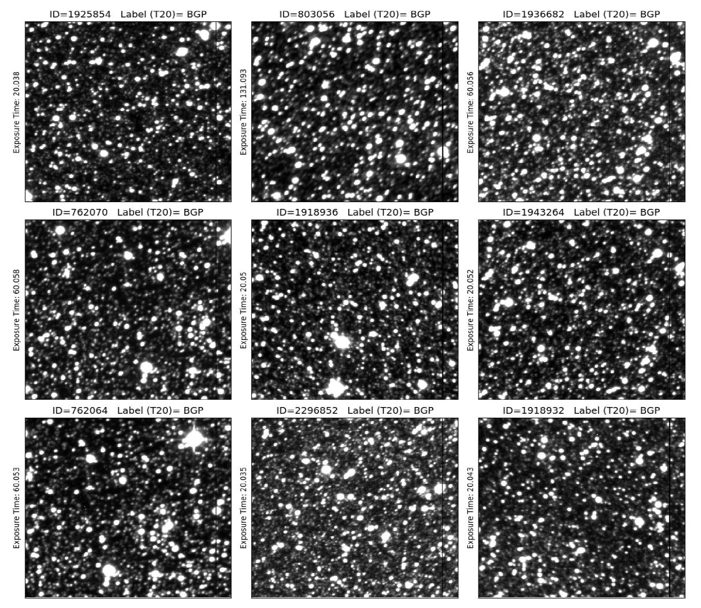

# Astro Unsupervised Deep Clustering

We have developed a method that maps large astronomical images onto a two-dimensional map and clusters them. A combination of various state-of-the-art machine learning (ML) algorithms is used to develop a fully unsupervised image quality assessment and clustering system.

# Methods and Training Procedure

Our labeling pipeline is shown in the graph below. It starts with a data pre-processing step where individual image objects are identified in a large astronomical image and converted to smaller pixel images. This data is then fed to a deep convolutional autoencoder jointly trained with a self-organizing map (SOM). This combined method is known as a deep embedded SOM (DESOM) [[1]](#1). A significant output of this part (DESOM-1) is a visual representation of a 25x25 map of prototype vectors. It is a good representation of objects in the training set. This presentation is extremely useful to visually assess and identify the types of objects present in the dataset.

Next, for a selected exposure, the output of DESOM-1 can be flattened to generate a histo-vector that contains 625 components. In other words, we convert image information to informative tabular data. This step is an excellent deep dimensionality reduction step, as well as recognizing useful patterns in each exposure. Such a matrix will be fed to another deep SOM (DESOM-2) to group the histo-vectors.

The generated histo-vectors are first normalized and then used to train DESOM-2. The result is a map of the size of 20x20. The end goal is that, images in one cell on DESOM-2 map should resemble each other.

# How to Use This Repository

The goal of this repository is to present a sample data set to test our pipeline. 150 exposures of various qualities are provided as a small test data set. The trained DESOM-1 and DESOM-2 model structure and weights are prvided in `data` folder. To run the test, simply open `pipeline.ipynb` and follow the steps. Additional details about each part of the pipeline is also provided in the notebook file.

The pipeline notebook file imports and sets up the trained DESOM-1 and DESOM-2 models. The map of prototype vectors from DESOM-1 is recunstructed. Then, a histo-vector is created for each test sample. Eventually, the location of the input data on the DESOM-2 map is determined by passing the data through the trained DESOM-2 model.

In summary, an exposure (as the primary input to the pipeline) will land on only one node on the second SOM with a known ID. In other words, an exposure with typically more than 360 million pixels will be mapped to a single point on the second map.

In order to run the initial preprocessing, run `MakeSmallCutouts.ipynb` notebook file in the Initial_Preprocessing folder. It contains detailed information about the process.

# Some Examples from Clustered Images

The graph below shows nine randomly selected images from a cell on the DESOM-2 map. This example shows that members of this cell have a bad focus nature.

As another example, the graph below shows nine randomly selected from another cell on DESOM-2 map. The images in this resemble each other, as expected, and they all have background problems.

### References
<a id="1">[1]</a> 
Forest, F. et. al. (2019). 
in European Symposium on Artificial Neural Networks, Computational Intelligence and Machine Learning (ESANN 2019), 1–6
